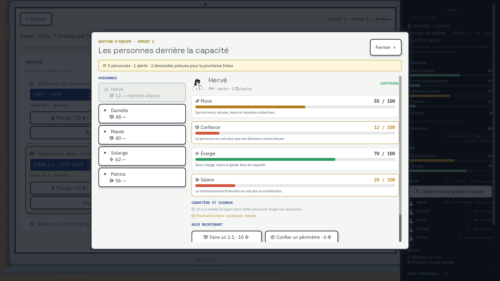
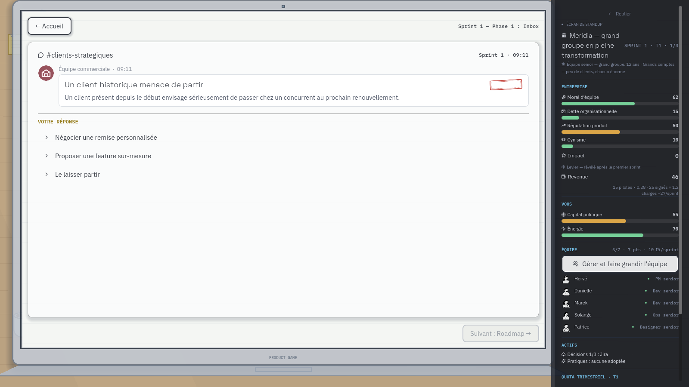
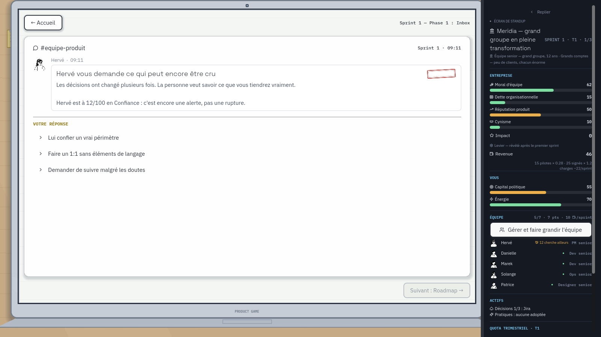

# Preuves visuelles — issue #43

Ces captures sont versionnées avec la PR pour que la revue ne dépende ni d'un
fichier temporaire ni d'un compte-rendu déclaratif. Elles sont générées à
1600×900 par `game/tests/screenshot_screens.tscn`.

```sh
SHOT_DIR="$(pwd)/docs/review-evidence/issue-43/nominal" godot --path game \
  --rendering-driver opengl3 --resolution 1600x900 res://tests/screenshot_screens.tscn
TEAM_ALERT_CAPTURE=1 SHOT_DIR="$(pwd)/docs/review-evidence/issue-43/alerte" godot --path game \
  --rendering-driver opengl3 --resolution 1600x900 res://tests/screenshot_screens.tscn
```

`nominal/` est le premier sprint intact : chaque personne est représentée par
un point stable, sans grille de quatre jauges. `alerte/` force Hervé à 12 de
Confiance et 20 de satisfaction salariale : le panneau doit afficher l'alerte,
programmer deux demandes et garder les quatre critères dans la fiche, plutôt
que d'ajouter 28 nombres au HUD.

## Hub de gestion — diagnostic et actions



La capture doit montrer le point d'entrée permanent, la liste compacte, les
quatre diagnostics expliqués, les demandes prévues dans l'Inbox et les actions
qui ont un coût réel sur la capacité ou la masse salariale.

## Inbox — les deux états relus





Les deux répertoires conservent aussi les onze écrans de recette afin de
vérifier que le panneau permanent ne se dégrade pas en changeant de phase.
