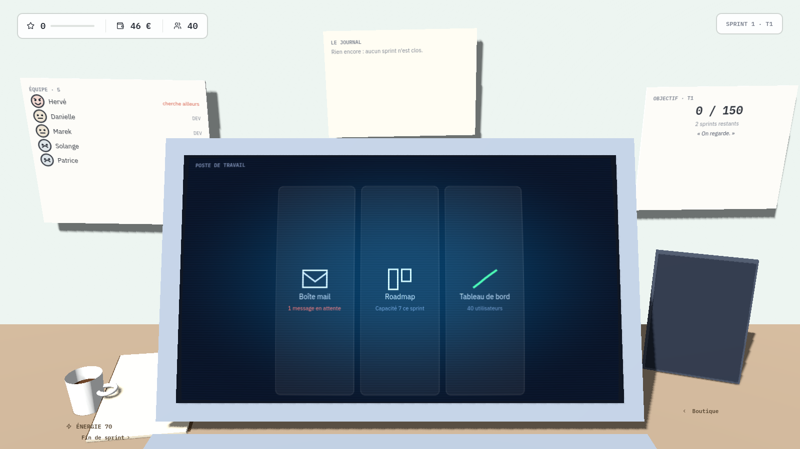
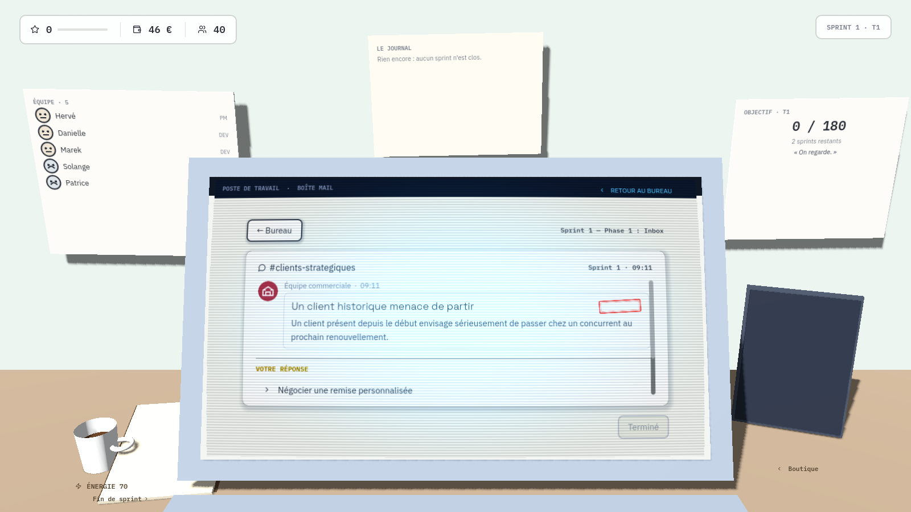
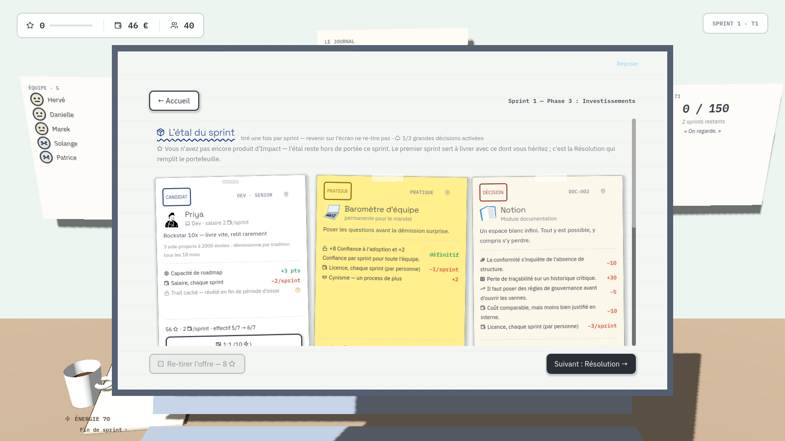
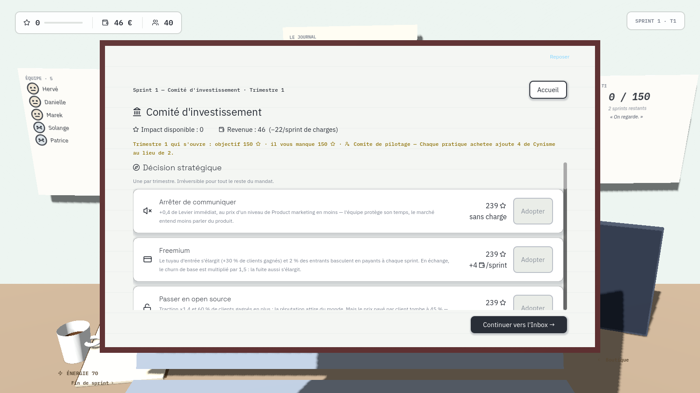
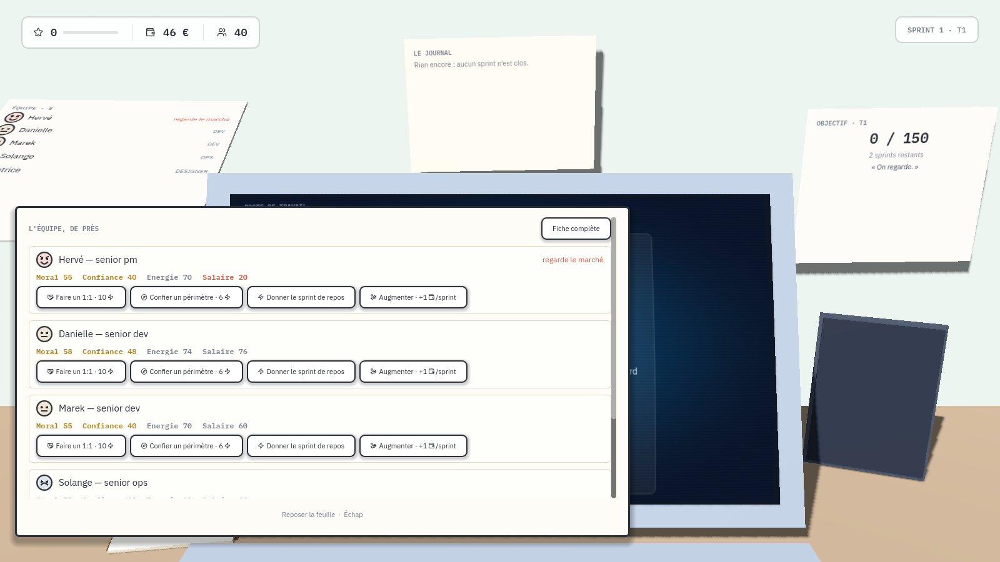
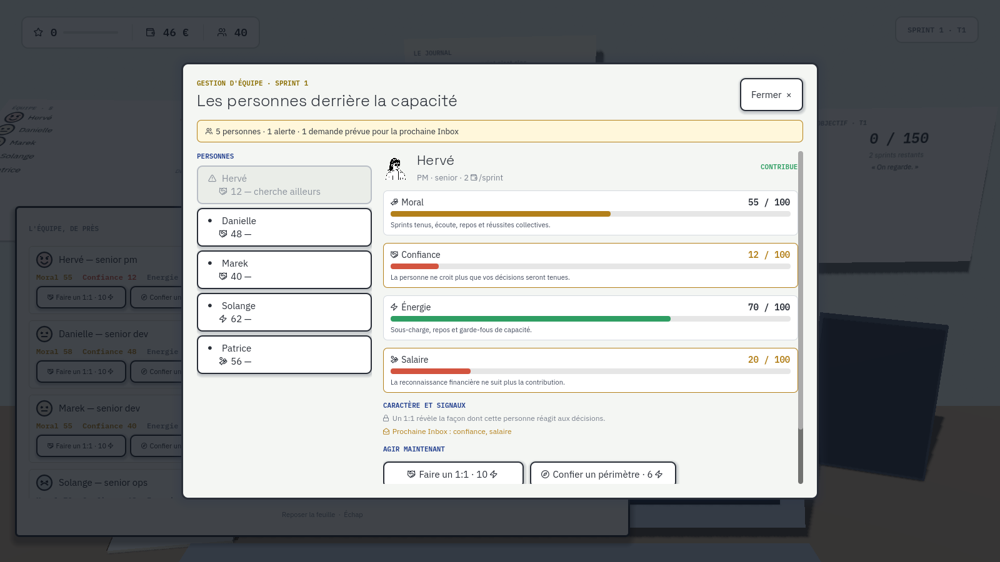

# Preuves visuelles — issue #59, le bureau en volume

Ces captures sont versionnées avec la PR pour que la revue ne dépende ni d'un
fichier temporaire ni d'un compte-rendu déclaratif. Elles sont générées à
1600×900 — la résolution réelle du viewport — par
`game/tests/screenshot_screens.tscn`.

```sh
SHOT_DIR="$(pwd)/docs/review-evidence/issue-59/nominal" xvfb-run -a godot --path game \
  --display-driver x11 --resolution 1600x900 res://tests/screenshot_screens.tscn
TEAM_ALERT_CAPTURE=1 SHOT_DIR="$(pwd)/docs/review-evidence/issue-59/alerte" xvfb-run -a godot \
  --path game --display-driver x11 --resolution 1600x900 res://tests/screenshot_screens.tscn
```

`nominal/` est le premier sprint intact. `alerte/` force Hervé à 12 de
Confiance et 20 de satisfaction salariale : le trombinoscope du mur doit le
montrer sans qu'on ait rien à ouvrir.

Seules les captures que ce lot change sont conservées. Les neuf autres écrans
sont inchangés — les rejouer produirait les mêmes images qu'à l'issue #43.

## Ce que chaque capture vérifie

### `desk_calme.png` — le bureau au repos, en volume


La pièce, la table, le portable, les trois papiers du mur et les objets posés
sont en volume : ombres portées réelles, tranches, perspective. Trois valeurs
permanentes en haut à gauche, et rien d'autre en permanence. Aucun élément ne
prend la largeur ni la hauteur du cadre.

### `alerte/desk_calme.png` — l'état d'alerte se lit sur le mur



Hervé porte un visage en détresse et la mention « cherche ailleurs » : le
Moral n'est écrit nulle part en chiffre, il se lit sur une tête. C'est
`get_employee_alert()` de #43 rendu visible sans ajouter de compteur.

### `desk_app.png` — critère de recette n°1



**La capture qui compte.** L'Inbox est hébergée dans le `SubViewport` de la
dalle : elle hérite de la perspective de la pièce, et son texte reste net et de
face. Si cette image montrait du texte flou ou incliné, le lot serait à
refuser.

### `desk_shop.png` — l'accessoire ouvert se présente droit



La tablette est venue se présenter devant le portable, encadrée par sa propre
matière. L'inclinaison appartient à l'animation d'entrée, pas à l'état posé :
les cartes se lisent de face.

### `desk_committee.png` — le parapheur du trimestre



Le dossier du board, déposé sur la table un sprint sur trois, ouvert en pleine
page. Hors franchissement de trimestre, l'objet est **absent** — pas grisé.

### `desk_poster.png` — la levée du poster



Le trombinoscope s'est soulevé comme une page de paperboard, et le détail par
personne apparaît dessous, **à plat et en 2D** : les quatre critères, les
actions du quotidien, et l'entrée de la fiche complète. Le bandeau de valeurs
reste visible par-dessus — aucune décision ne se prend à l'aveugle.

### `team_management_screen.png` — le hub d'équipe, toujours atteignable



Son entrée vivait dans le Panneau de bord permanent, supprimé par ce lot. Elle
est maintenant sous le poster levé : le poster porte le quotidien, le hub porte
l'irréversible (se séparer de quelqu'un demande une confirmation, donc un
modal, ce que la levée refuse d'être).

## Ce que ces captures ne prouvent pas

Chaque image est un instantané d'une scène instanciée seule. Elles ne disent
rien du **mouvement** — la glissade d'un accessoire, la levée d'une feuille, le
soulèvement d'une tuile au survol — ni des **enchaînements**, ni du routage des
clics dans les `SubViewport`. La moitié de ce lot est là-dedans, et seul un run
visuel humain peut la juger.
